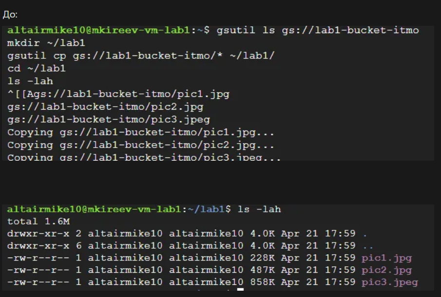
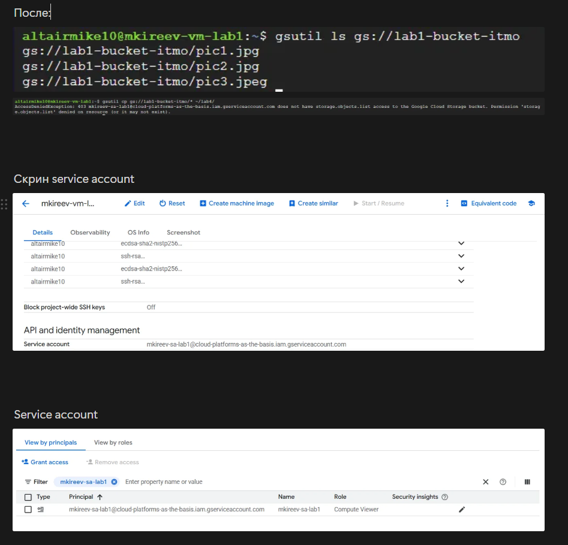

University: [ITMO University](https://itmo.ru/ru/)

Faculty: [FICT](https://fict.itmo.ru)

Course: [Cloud platforms as the basis of technology entrepreneurship](https://itmo-ict-faculty.github.io/cloud-platforms-as-the-basis-of-technology-entrepreneurship/education/labs2023-2024/lab1/lab1/#_2)

Year: 2025/2026

Group: HBM

Author: Kireev Mikhail Igorevich

Lab: Lab1

Date of create: 21.04.2025

Date of finished: 22.04.2025

# Лабораторная работа 1

## Подключение через SSH

## Проверка копирования файлов

## Подготовка

До начала работы я заполнил Google-форму и получил доступ к проекту в Google Cloud Platform.

## Создание сервисного аккаунта

Во время лабораторной работы я создал сервисный аккаунт с ролью **Storage Admin**.  
Имя аккаунта было выбрано по формату, указанному в задании: первая буква имени и фамилия с добавлением `-sa-lab1`.

## Создание виртуальной машины

Далее я создал виртуальную машину в разделе **Compute Engine**.  
Для этого использовал минимальную конфигурацию:
- Тип машины: `e2-micro`
- Режим работы: **Spot**

Название виртуальной машины также соответствовало требуемому формату: первая буква имени, фамилия и `-vm-lab1`.

## Подключение и работа с файлами

После настройки машины я подключился к ней через SSH прямо из консоли Google Cloud.  
С помощью утилиты `gsutil` я нашёл бакет `lab1-bucket-itmo`, в котором были размещены необходимые файлы.

Для копирования файлов я:
1. Создал на виртуальной машине новую папку.
2. Скопировал туда три файла из облачного хранилища.

Проверка командой `ls -lah` показала, что все файлы успешно скопированы и находятся на месте.

## Изменение прав доступа

Следующим этапом было изменение прав доступа сервисного аккаунта.  
Я изменил роль с **Storage Admin** на **Compute Viewer**, чтобы проверить, как это повлияет на возможность работы с бакетом.

После изменения прав я снова попытался скопировать файлы из бакета.  
В результате возникла ошибка доступа — копирование стало невозможно, так как у сервисного аккаунта больше не было необходимых разрешений на работу с объектами в Cloud Storage.
