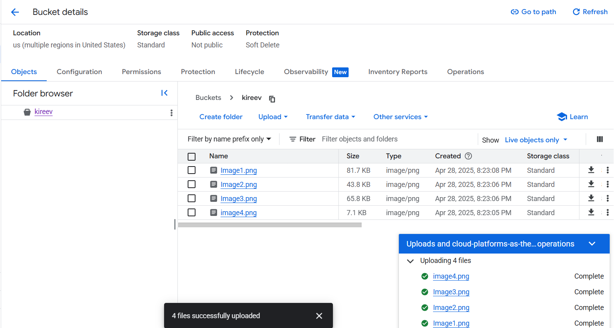
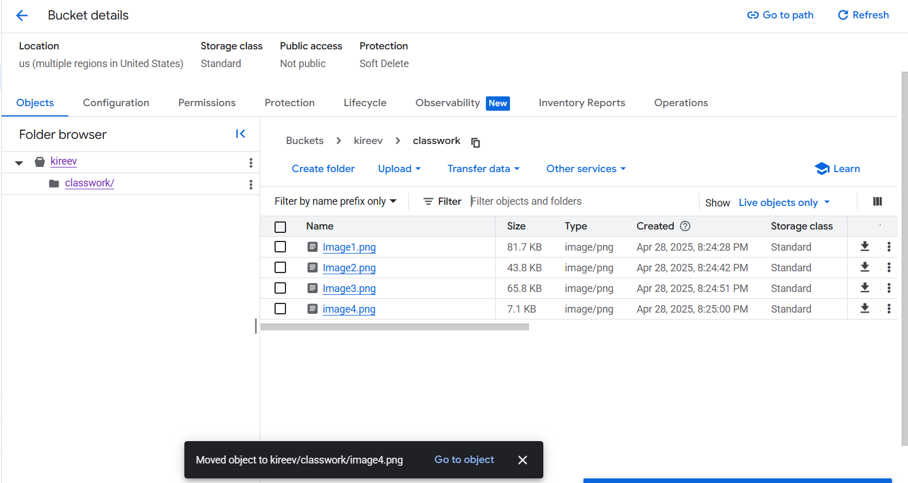
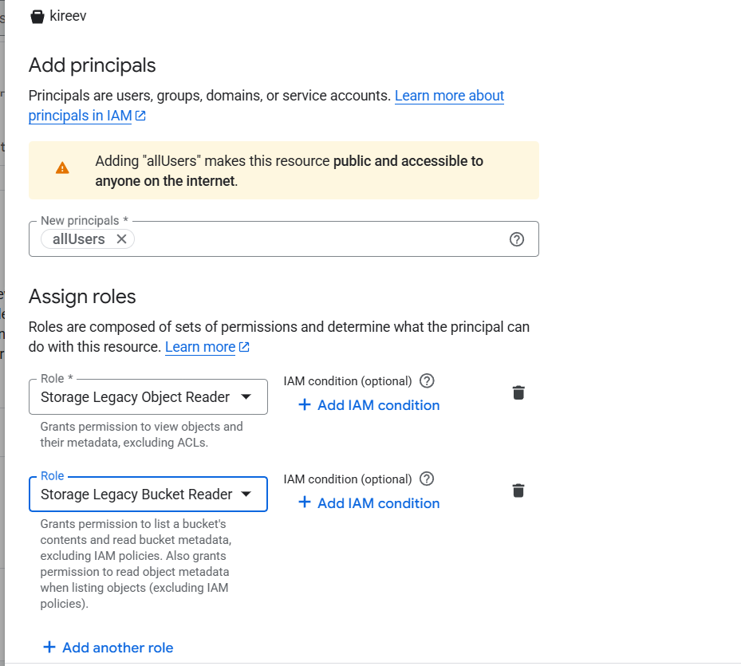
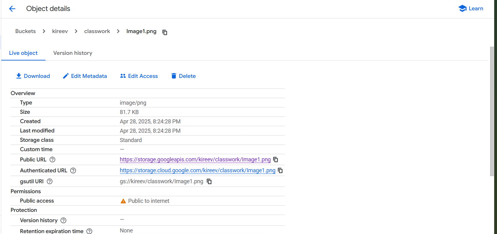
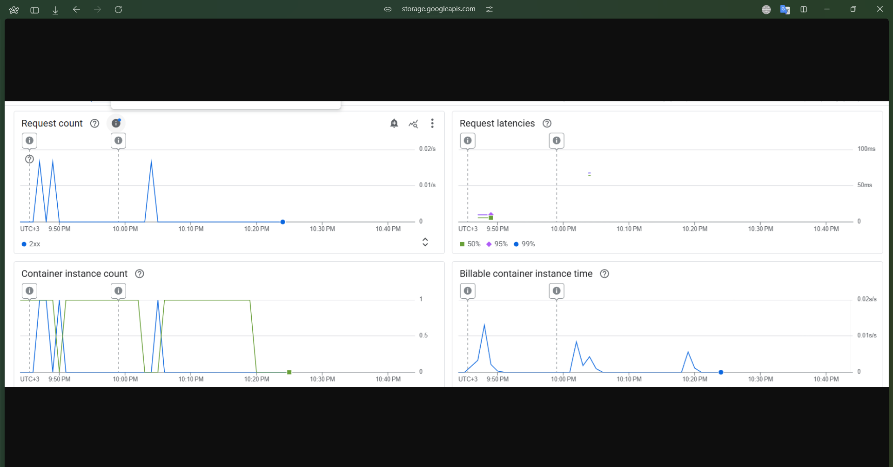

University: [ITMO University](https://itmo.ru/ru/)

Faculty: [FTMI](https://ftmi.itmo.ru)

Course: [Cloud platforms as the basis of technology entrepreneurship](https://itmo-ict-faculty.github.io/cloud-platforms-as-the-basis-of-technology-entrepreneurship/education/labs2023-2024/lab1/lab1/#_2)

Year: 2025/2026

Group: HBM

Author: Kireev Mikhail Igorevich

Lab: Lab3

Date of create: 29.04.2025

Date of finished: 29.04.2025

# Лабораторная работа 3
# Лабораторная работа 3

## Цель работы
Ознакомиться с основными понятиями и принципами работы облачного хранилища, изучить различные модели хранения данных (блочное, файловое и объектное хранилище), познакомиться с основными сервисами и функционалом, предоставляемым облачными хранилищами.

## Ход работы

### 1. Загрузка файлов в Cloud Storage

- Были загружены изображения в созданный Cloud Storage bucket.
- Скриншот процесса загрузки файлов:

  - 

### 2. Создание папки и перенос файлов

- Создана новая папка в пределах бакета.
- Загруженные файлы были перенесены в эту папку.

  - 

### 3. Настройка публичного доступа

- Открыл настройки доступа для файлов.
- Убрал все существующие правила доступа.
- Добавил правило доступа для **allUsers** с разрешением **Grant Access**.

  - 

### 4. Получение публичных ссылок

- Нажал на имя файла в списке.
- Перешел по ссылке **Public URL** для каждого файла.

  - 
  - 

- Проверил доступность файлов через публичные ссылки — всё работало корректно.

### 5. Завершение работы

- После выполнения всех действий созданнысервисы и файлы были удалены 

