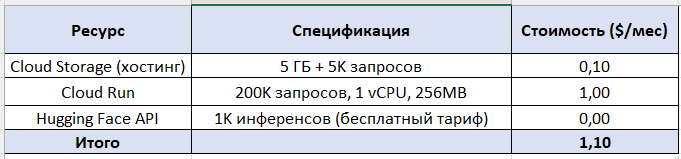

University: [ITMO University](https://itmo.ru/ru/)

Faculty: [FTMI](https://ftmi.itmo.ru)

Course: [Cloud platforms as the basis of technology entrepreneurship](https://itmo-ict-faculty.github.io/cloud-platforms-as-the-basis-of-technology-entrepreneurship/education/labs2023-2024/lab1/lab1/#_2)

Year: 2025/2026

Group: HBM

Author: Kireev Mikhail Igorevich

Lab: Lab3

Date of create: 03.04.2025

Date of finished: 06.05.2025

# Лабораторная работа №4  
**Тема:** Разработка инфраструктуры MVP AI-приложения  
**Цель:** Спроектировать архитектуру AI-приложения на трёх этапах жизненного цикла, обосновать выбор облачных ресурсов и рассчитать приблизительные ежемесячные затраты.

---

## 1. Начальный этап (PoC)

**Архитектура:**
- Frontend: Cloud Storage (статичные HTML/JS-файлы)
- Backend: Cloud Run (контейнер с REST API)
- AI-модель: Внешний API (например, Hugging Face Inference API)
- Хранение данных: Cloud Storage
- База данных: не используется

**Описание:**  
Минимальная конфигурация с внешним AI и без БД. Все данные хранятся в Cloud Storage. Простой способ быстро протестировать гипотезу.

**Финансовые расчёты:** 

**Схема:** 

 
Архитектура упрощена до минимума: без БД, с использованием внешнего API. Решение не требует настройки инфраструктуры и даёт быстрый старт.

## 2. Этап тестирования с партнёрами

**Архитектура:**
- Frontend: Cloud Storage + Load Balancer
- Backend: App Engine Standard (Python)
- AI-модель: Hugging Face API
- База данных: Cloud Datastore (NoSQL)
- Мониторинг: Cloud Logging

**Описание:**  
Добавлена балансировка, логирование и NoSQL БД. Приложение развернуто на App Engine, не требует контейнеров. Подходит для тестирования на реальных пользователях.

**Финансовые расчёты:** 

**Схема:**

App Engine обеспечивает масштабируемость без контейнеров. Datastore упрощает работу с данными, логирование помогает отследить поведение системы под нагрузкой.

---

## 3. Прод решение

**Архитектура:**
- Frontend: Cloud CDN + Cloud Storage
- Backend: Cloud Run Jobs + Workflows
- AI-модель: Vertex AI Prediction (CPU)
- База данных: Cloud Bigtable
- Очереди: Pub/Sub
- Безопасность и аналитика: Cloud Logging, Cloud Armor

Инфраструктура автоматизирована. Используются Jobs и Workflows, масштабируемая Bigtable и компоненты безопасности. Инференс перенесён на Vertex AI.

**Финансовые расчёты:** 

**Схема:**

  
Используются автоматизированные и масштабируемые компоненты. Kubernetes не требуется. Решение устойчиво к нагрузке и готово к продакшн-использованию.

## Выводы

Была разработана архитектура AI-приложения на трёх этапах жизненного цикла. 

Для PoC выбрано простейшее решение без БД и собственной модели. 

На этапе тестирования добавлены балансировка, база данных и логирование. 

Продовая версия построена на облачных компонентах с автоматизацией процессов, масштабируемым хранилищем и встроенной безопасностью. Такой подход позволяет оптимизировать расходы и развивать систему по мере роста.

